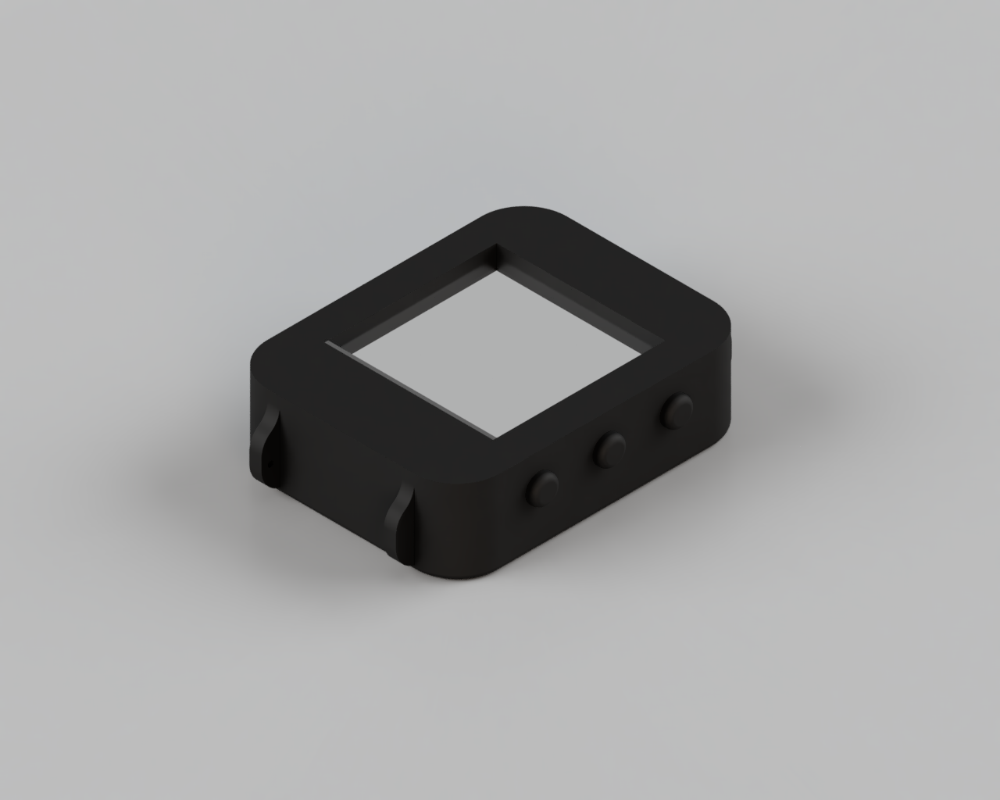
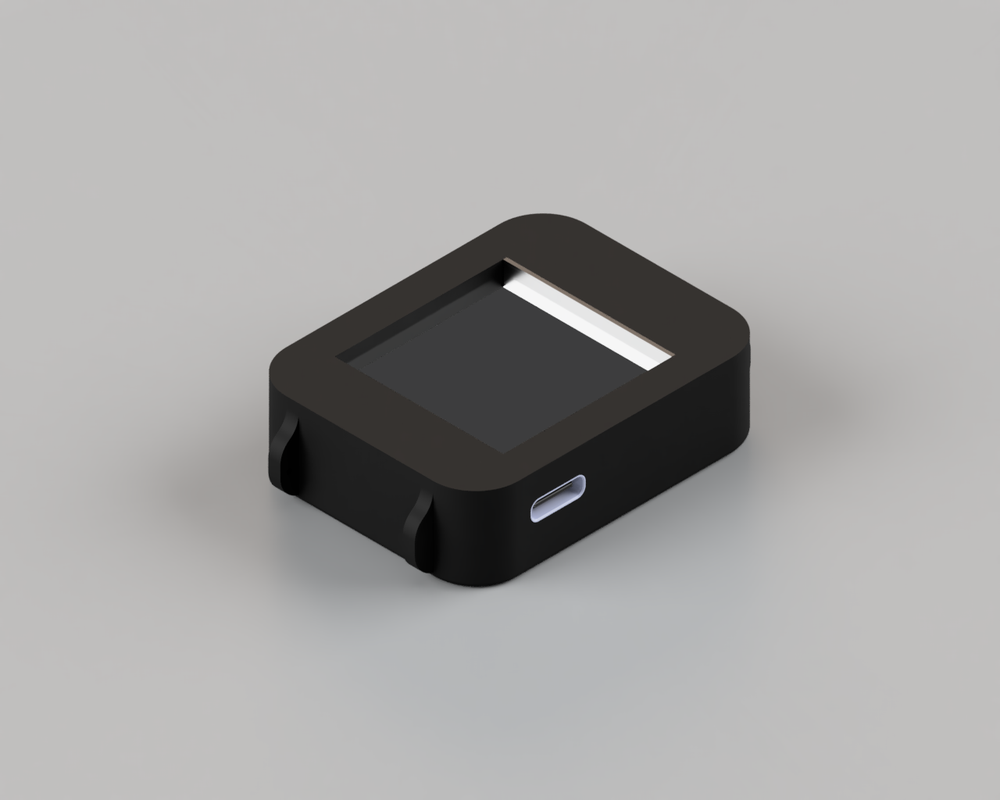
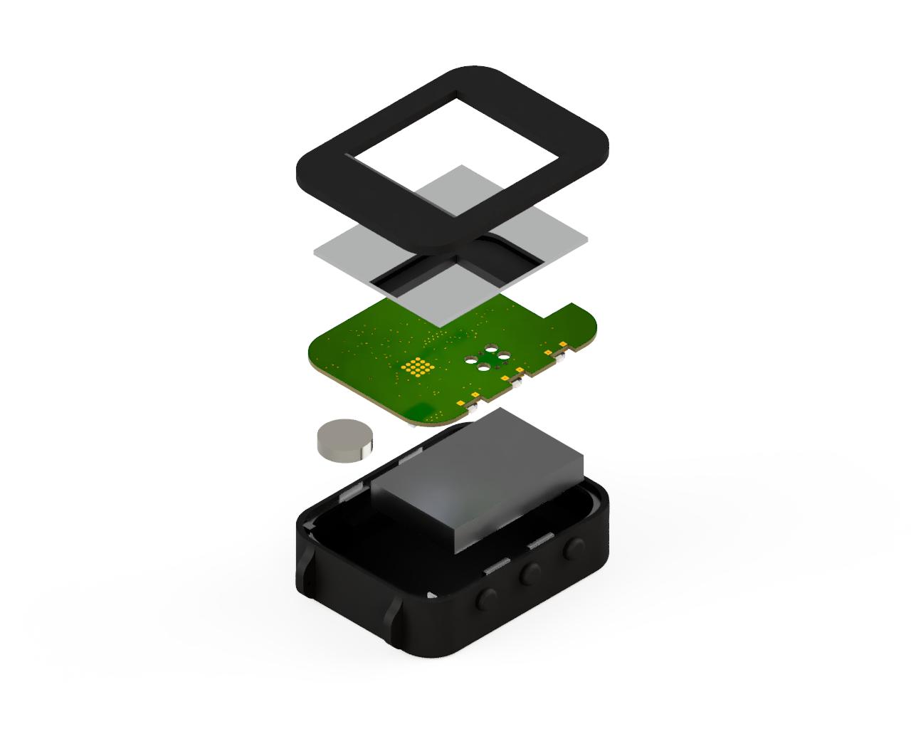
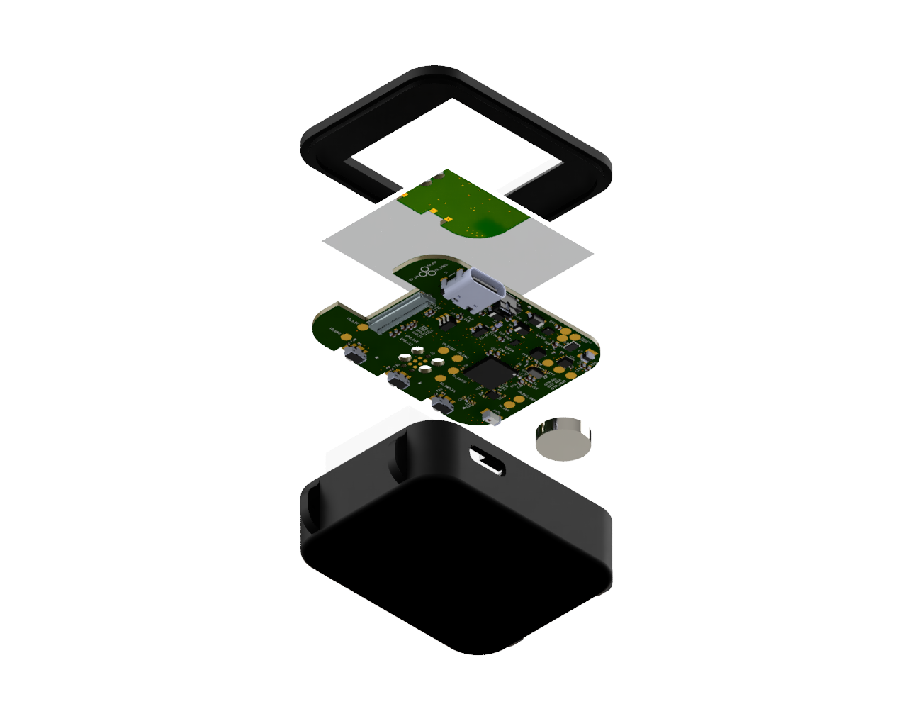
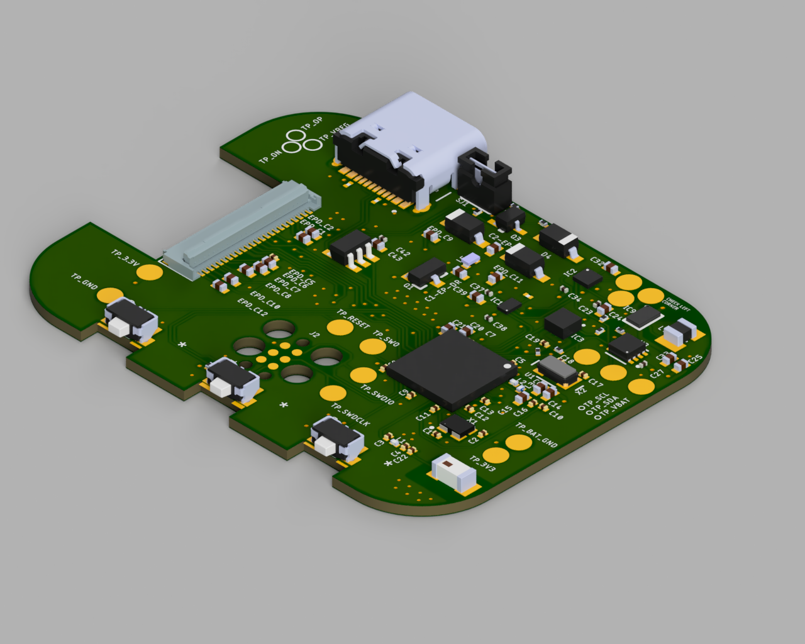
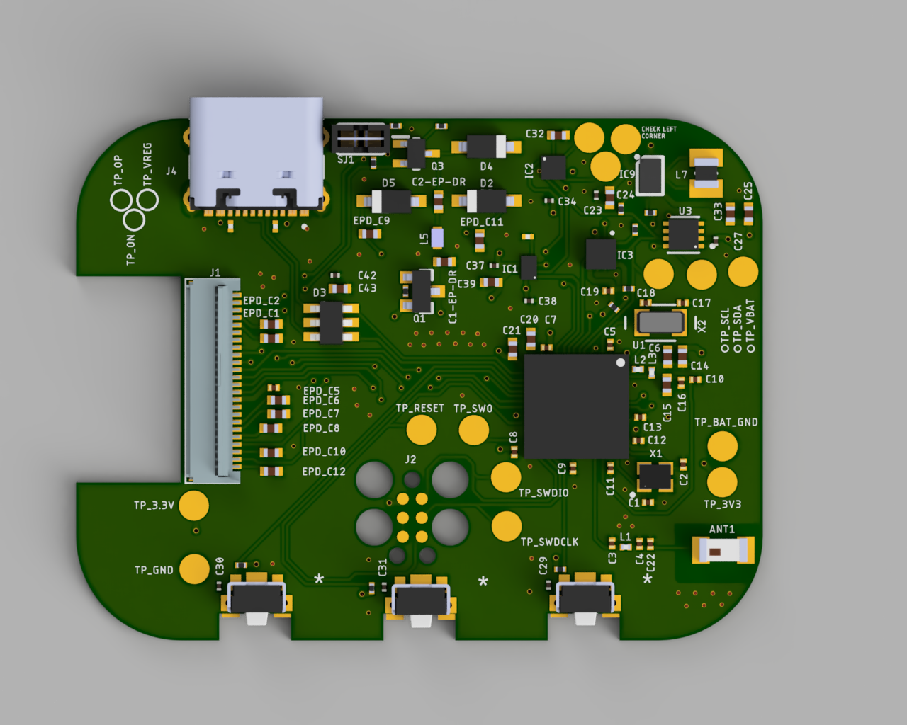
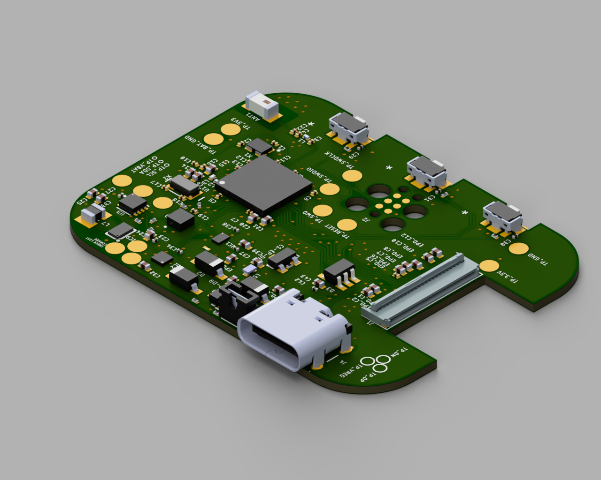

# InkTime Smartwatch
The low-powered open-source e-paper watch.

## Final Assembly

  
  

## Block Diagram

  

## Bill of Materials
| Ref | Componenta | Valoare | JLC Parts | Datasheet |
|-----|------------|---------|-----------|-----------|
| U1 | nRF52840 | $5.14 | [JLC](https://jlcpcb.com/parts/componentSearch?searchTxt=nRF52840-QF) | [DS](https://jlcpcb.com/api/file/downloadByFileSystemAccessId/8589839228197629952) |
| J1 | 503480-2400 | $0.84 | [JLC](https://jlcpcb.com/partdetail/MOLEX-5034802400/C122434) | [DS](https://www.molex.com/content/dam/molex/molex-dot-com/products/automated/en-us/salesdrawingpdf/503/503480/5034802400_sd.pdf?inline) |
| IC1 | BQ25180YBGR | $2.01 | [JLC](https://jlcpcb.com/partdetail/TexasInstruments-BQ25180YBGR/C3682423) | [DS](https://www.ti.com/cn/lit/gpn/bq25180) |
| X2 | FC-135_32.7680KA-A3 | $0.2677 | [JLC](https://jlcpcb.com/partdetail/SeikoEpson-FC_135_32_7680KAA3/C2650472) | [DS](https://jlcpcb.com/partdetail/SeikoEpson-FC_135_32_7680KAA3/C2650472) |
| Q1 | DMG2305UX-7 | $0.10 | [JLC](https://jlcpcb.com/partdetail/DiodesIncorporated-DMG2305UX7/C150470) | [DS](https://jlcpcb.com/api/file/downloadByFileSystemAccessId/8560079443617075200) |
| D5 | MBR0530 | $0.03 | [JLC](https://jlcpcb.com/partdetail/78464-MBR0530/C77336) | [DS](https://jlcpcb.com/api/file/downloadByFileSystemAccessId/8586175081181818880) |
| IC9 | RT6160 | $0.56 | [JLC](https://jlcpcb.com/partdetail/RichtekTech-RT6160AWSC/C7065276) | [DS](https://jlcpcb.com/api/file/downloadByFileSystemAccessId/8600398231234883584) |
| L2 | RC0402JR-070RL | $0.01 | [JLC](https://jlcpcb.com/partdetail/YAGEO-RC0402JR070RL/C60485) | [DS](https://jlcpcb.com/api/file/downloadByFileSystemAccessId/8717146932348461056) |
| J4 | KH-TYPE-C-16P | $0.08 | [JLC](https://jlcpcb.com/partdetail/Shenzhen_KinghelmElec-KH_TYPE_C16P/C709357) | [DS](https://jlcpcb.com/api/file/downloadByFileSystemAccessId/8588905154556923904) |
| SWD | TC2030-IDC | $100.26 | [JLC](https://jlcpcb.com/partdetail/MicrochipTech-TC2030_CLIP3PACK/C5444772) | [DS](https://www.lcsc.com/datasheet/lcsc_datasheet_2403201318_Microchip-Tech-TC2030-CLIP-3PACK_C5444772.pdf) |
| U3 | MAX17048G-T10 | $2.44 | [JLC](https://jlcpcb.com/partdetail/2777647-MAX17048GT10/C2682616) | [DS](https://jlcpcb.com/api/file/downloadByFileSystemAccessId/8588907428524003328) |
| D3 | USBLC6-2SC6Y | $0.24 | [JLC](https://jlcpcb.com/partdetail/STMicroelectronics-USBLC62SC6Y/C2969755) | [DS](https://jlcpcb.com/api/file/downloadByFileSystemAccessId/8603165824304111616) |
| L3 | RC0402JR-070RL | $0.01 | [JLC](https://jlcpcb.com/partdetail/YAGEO-RC0402JR070RL/C60485) | [DS](https://jlcpcb.com/api/file/downloadByFileSystemAccessId/8717146932348461056) |
| X1 | NX2016SA-32MHZ-EXS00A-CS11336 | $9.04 | [JLC](https://jlcpcb.com/partdetail/NDK-NX2016SA_32MHZ_EXS00ACS11336/C6134317) | [DS](https://jlcpcb.com/api/file/downloadByFileSystemAccessId/8603064888214908928) |
| ANT1 | 2450AT18B100E | $1.03 | [JLC](https://jlcpcb.com/partdetail/JohansonDielectrics-2450AT18B100E/C2917717) | [DS](https://jlcpcb.com/api/file/downloadByFileSystemAccessId/8588940948130156544) |
| Q3 | SI1308EDL-T1-GE3 | $0.18 | [JLC](https://jlcpcb.com/partdetail/VishayIntertech-SI1308EDL_T1GE3/C469327) | [DS](https://jlcpcb.com/api/file/downloadByFileSystemAccessId/8588884784742846464) |
| IC2 | DRV2605YZFR | $1.31 | [JLC](https://jlcpcb.com/partdetail/TexasInstruments-DRV2605YZFR/C81079) | [DS](https://www.ti.com/cn/lit/gpn/drv2605) |
| D2 | MBR0530 | $0.03 | [JLC](https://jlcpcb.com/partdetail/78464-MBR0530/C77336) | [DS](https://jlcpcb.com/api/file/downloadByFileSystemAccessId/8586175081181818880) |
| IC3 | BMA423 | $11.30 | [JLC](https://jlcpcb.com/partdetail/BoschSensortec-BMA423/C189517) | [DS](https://jlcpcb.com/api/file/downloadByFileSystemAccessId/8588894317147017216) |
| L7 | MLP2016SR47MT0S1 | $0.10 | [JLC](https://jlcpcb.com/partdetail/TDK-MLP2016SR47MT0S1/C87545) | [DS](https://jlcpcb.com/api/file/downloadByFileSystemAccessId/8588933367512879104) |
| L5 | 744043680 | $9.53 | [JLC](https://jlcpcb.com/partdetail/WurthElektronik-744043680/C2045671) | [DS](https://www.we-online.com/components/products/datasheet/744043680.pdf) |
| D4 | MBR0530 | $0.03 | [JLC](https://jlcpcb.com/partdetail/78464-MBR0530/C77336) | [DS](https://jlcpcb.com/api/file/downloadByFileSystemAccessId/8586175081181818880) |

## Hardware Overview
- `nRF52840 (U1)`: main MCU; handles BLE, USB, timekeeping, button logic, display refresh, and power-state control.
- `BQ25180 (IC1)`: LiPo charger and power-path manager; takes `VBUS` from USB-C, charges the battery, and exposes status on `I2C` plus `PMIC_INT`.
- `RT6160 (IC9)`: buck-boost regulator; converts the charger `SYS/VREG` rail into the stable `3V3` rail used by the digital system.
- `BMA421 IMU (IC3 schematic value)`: accelerometer/pedometer connected over `I2C`; `INT1` and `INT2` wake the MCU on motion and step events.
- `MAX17048 (U3)`: fuel gauge connected to raw `VBAT`; reports battery state over `I2C` and raises `ALERT` on low-battery thresholds.
- `DRV2605L (IC2)`: haptic driver on `I2C`; enabled by `HAPTIC_EN` and drives the vibration motor through `OUT+` and `OUT-`.
- `E-paper display (J1)`: connected through `SPI` (`SCK`, `MOSI`, `CS`) plus `DC`, `RST`, and `BUSY`; uses a dedicated switched rail so the panel can be fully turned off between updates.
- `USB-C + ESD (J4 + D3)`: provides `VBUS` power, USB `D+ / D-`, and surge protection for the MCU USB interface.
- `Debug + bring-up`: Tag-Connect `TC2030` exposes `SWDIO`, `SWDCLK`, and `RESET` for flashing and recovery.
- `Power strategy`: `USB-C 5V -> BQ25180 -> RT6160 -> 3V3`; the watch stays in low-power sleep most of the time, wakes on RTC/buttons/interrupts, and uses e-paper partial refreshes to keep average power low.
- `Communication`: shared `I2C` bus for PMIC, regulator, IMU, fuel gauge, and haptic driver; `SPI` for the display; `BLE` for the phone link.

## Exploded Assembly

  
  

## nRF52840 Pin Mapping
| nRF52840 Pin | Signal | Component | Interface |
|--------------|--------|-----------|-----------|
| P0.00/XL1 | XL1 | Crystal X2 (32.768kHz) | XTAL |
| P0.01/XL2 | XL2 | Crystal X2 (32.768kHz) | XTAL |
| P0.02/AIN0 | SCK | E-Paper (J1 FPC) | SPI SCK |
| P0.03/AIN1 | MOSI | E-Paper (J1 FPC) | SPI MOSI |
| P0.05/AIN3 | EPD_CS | E-Paper (J1 FPC) | SPI CS |
| P0.06 | SDA | BMA421, BQ25180, RT6160, MAX17048, DRV2605 | I2C SDA |
| P0.07 | SCL | BMA421, BQ25180, RT6160, MAX17048, DRV2605 | I2C SCL |
| P0.08 | IMU_INT1 | BMA421 | GPIO Input |
| P1.08 | IMU_INT2 | BMA421 | GPIO Input |
| P0.10/NFC2 | ALERT | MAX17048 | GPIO Input |
| P0.11 | PMIC_INT | BQ25180 | GPIO Input |
| P0.12 | HAPTIC_EN | DRV2605 | GPIO Output |
| P0.13 | SW_UP | Up button | GPIO Input |
| P0.14 | SW_ENT | Enter button | GPIO Input |
| P0.15 | EPD_DC | E-Paper (J1 FPC) | SPI DC |
| P0.16 | EPD_RST | E-Paper (J1 FPC) | GPIO Output |
| P0.17 | EPD_BUSY | E-Paper (J1 FPC) | GPIO Input |
| P0.18/RESET | RESET | TC2030-IDC | SWD / GPIO |
| P1.02 | SW_DN | Down button | GPIO Input |
| VBUS | VBUS | USB-C (J4) | Power |
| D- | D- | USB-C (J4) / USBLC6 | USB |
| D+ | D+ | USB-C (J4) / USBLC6 | USB |
| SWDCLK | SWDCLK | TC2030-IDC | SWD |
| SWDIO | SWDIO | TC2030-IDC | SWD |
| ANT | RF | 2450AT18B100E antenna | RF |

## PCB Views

  
  
  

## Log Journal
- Grouping IC's with their respective passive components.
- Placing them so ratsnest is as straight as possible on the board.
- Route critical signal first.
- Route power.
- Route rest.

Clean ERC. Ignored micro-via errors in DRC because without them routing the BGA would have been impossible.